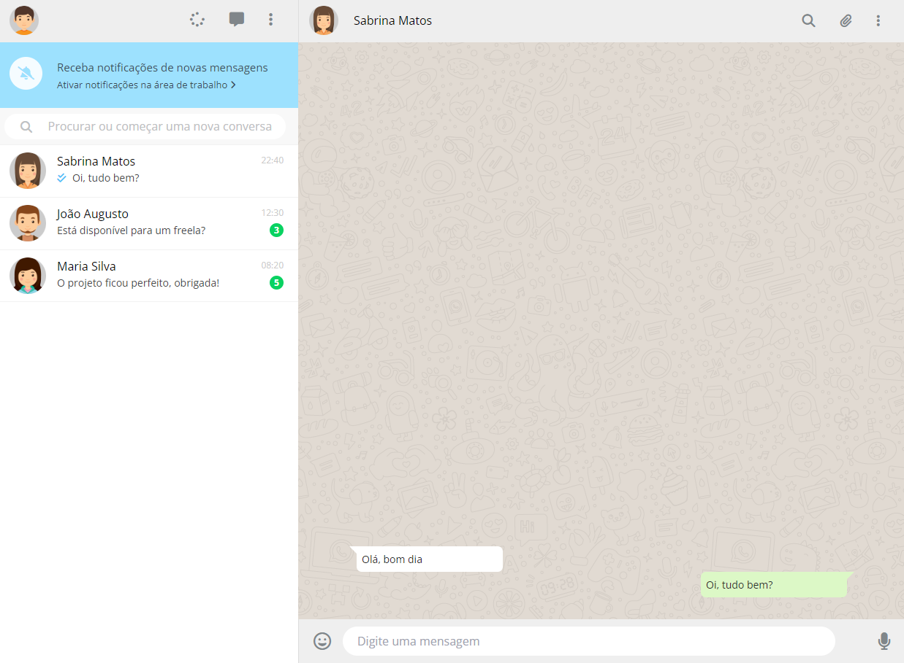

<div align="center">
  <h1>WhatsApp Web Single Page</h1>
  <p>Single page clone da interface do WhatsApp Web, com intuito de estudos sobre HTML e CSS e suas propriedades.</p>
  
</div>

# 📒 Índice
* [Descrição](#descrição)
* [Requisitos Funcionais](#requisitos)
* [Tecnologias](#tecnologias)
* [Design](#design)
  * [Cores](#cores)
  * [Fontes](#fontes)
  * [Ícones](#ícones)
* [Instalação](#instalação)
* [Licença](#licença)

# 📃 <span id="descrição">Descrição</span>
Single page clone da interface do WhatsApp Web, com intuito de estudos sobre HTML e CSS e suas propriedades.

# 📌 <span id="requisitos">Requisitos Funcionais</span>
- [x] Validação de usuários<br>

# 💻 <span id="tecnologias">Tecnologias</span>
- **HTML**
- **CSS**

# 🎨 <span id="design">Design</span>
- O modelo final para versão desktop e mobile está disponível na pasta `./design`

- <span id="cores">Cores<br></span>
  * #EEE<br>
  * #CCC<br>
  * #80868A<br>
  * #9DE1FE<br>
  * #384C56<br>
  * #F5FCFF<br>
  * #F8F8F8<br>
  * #BDC1C3<br>
  * #F2F2F2<br>
  * #f4f5f5<br>
  * #E9EBEB<br>
  * #454545<br>
  * #4FC3F7<br>
  * #09D261<br>
  * #DDD<br>
  * #E1DAD2<br>
  * #EFEFEF<br>

- <span id="fontes">Fontes<br></span>
  * OpenSans, sans-serif

- <span id="ícones">Ícones<br></span>
  * Fontawesome

# 🚀 <span id="instalação">Instalação</span>
```bash
  # Clone este repositório:
  $ git clone https://github.com/CleilsonAndrade/whatsapp_web_single_page
  $ cd ./whatsapp_web_single_page
```

# 📝 <span id="licença">Licença</span>
Esse projeto está sob a licença MIT. Veja o arquivo [LICENSE](LICENSE) para mais detalhes.

---

<p align="center">
  Feito com 💜 by CleilsonAndrade
</p>